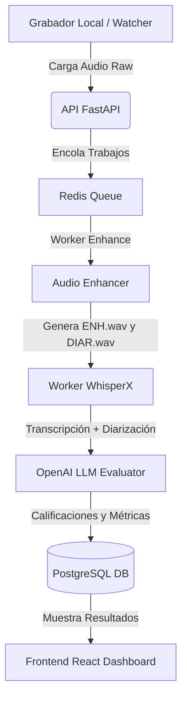

# Control de Cajas y Análisis de Voz - Ferretería

Este sistema permite la ingesta, optimización, transcripción, diarización y análisis automático mediante IA de las grabaciones de audio en los mostradores de caja de la ferretería. Ayuda a evaluar el desempeño de los cajeros en base a criterios de atención y proporciona un reproductor interactivo progresivo para auditoría.

---

## 🏗️ Arquitectura del Sistema

El sistema está compuesto por los siguientes componentes modulares que interactúan mediante contenedores Docker:



### 📦 Descripción de Componentes

1. **Frontend (React + Vite) (`/frontend`)**:
   * Interfaz web responsiva desarrollada con React, Recharts y Tailwind/CSS personalizado.
   * Dashboard con estado de conexión de cajeros, conteo de atenciones diarias, y modal detallado de auditoría.
   * Incluye un **reproductor de audio personalizado** con reproducción progresiva (HTTP Range Requests), rebobinado/adelanto de 10s y velocidad variable (`1x`, `1.25x`, `1.5x`, `2x`).

2. **Backend API (FastAPI) (`/app`)**:
   * Expone endpoints para el registro de atenciones, métricas de auditoría, y streaming de audio.
   * La transmisión de audio utiliza `FileResponse` con soporte para rangos HTTP (Partial Content 206), permitiendo a los clientes web adelantar y pausar sin descargar el audio completo.

3. **Enhance Worker (FFmpeg) (`/rq_workers/enhance_worker.py`)**:
   * Procesa el audio bruto (`_raw`) y genera dos salidas:
     * `_ENH.wav`: Con filtros de ecualización paramétrica, compresión suave y normalización para el reconocedor de voz.
     * `_DIAR.wav`: Con ecualización mínima (solo paso alto a 90 Hz) para no distorsionar las huellas de voz de los hablantes en Pyannote.
   * Calcula métricas acústicas en base a densidades de energía (0-80 Hz, 80-300 Hz, etc.) y detecta el piso de ruido con umbrales adaptativos.

4. **WhisperX & Pyannote Worker (`/whisperx_worker/whisperx_worker.py`)**:
   * Transcribe con `large-v3-turbo` sobre el audio mejorado y diariza con Pyannote sobre el audio de diarización.
   * Asocia las palabras al hablante correcto. Si existe un espacio de silencio mayor a 5 segundos entre segmentos de voz, asigna la palabra a `UNKNOWN` para evitar falsos positivos de herencia del cajero.
   * Incluye un **filtro absoluto anti-alucinaciones** que descarta cualquier frase con patrones de sitios web (`www.`, `http`, `.com`, `.gov`).

5. **LLM Worker (`/rq_workers/llm_worker.py`)**:
   * Envía el texto diarizado a OpenAI `gpt-4o-mini` para analizar las preguntas de control de calidad y guardar las métricas finales en PostgreSQL.

---

## 🛠️ Requisitos de Instalación

Asegúrate de tener instalado en el servidor:
* **Docker** y **Docker Compose**
* Tarjeta gráfica compatible con CUDA (Recomendado para acelerar WhisperX)

---

## 🚀 Guía de Despliegue Rápido

1. **Configurar el archivo `.env`**:
   Copia y configura tus variables de entorno esenciales (credenciales de BD, Redis, API Key de OpenAI y Token de HuggingFace para Pyannote).

2. **Compilar y levantar los contenedores**:
   ```bash
   docker compose build
   docker compose up -d
   ```

3. **Verificar el estado del sistema**:
   ```bash
   docker compose ps
   ```

4. **Monitorear las colas de procesamiento**:
   ```bash
   docker compose exec api python monitor_queues.py
   ```
